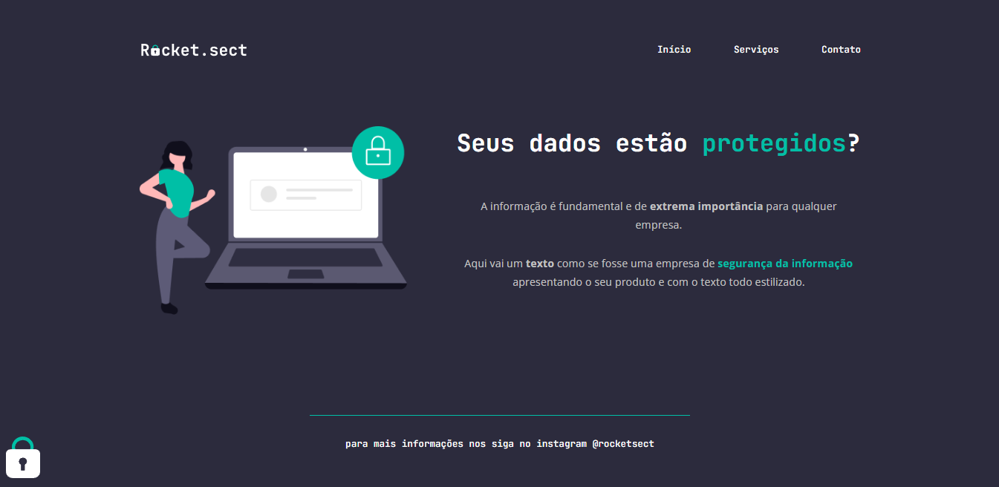

# 🚀 Trilha Explorer

> Projeto recriado do 0 a a partir de um Layout do Figma durante o curso Explorer pela Rocketseat!

[🔗Clique para acessar](https://rodkunz.github.io/desafio-avancado-rocketsect/)
## 🛠 Tecnologias utilizadas

- HTML
- CSS
- Git e Github

## 💻 Contato

raokrodrigo@gmail.com